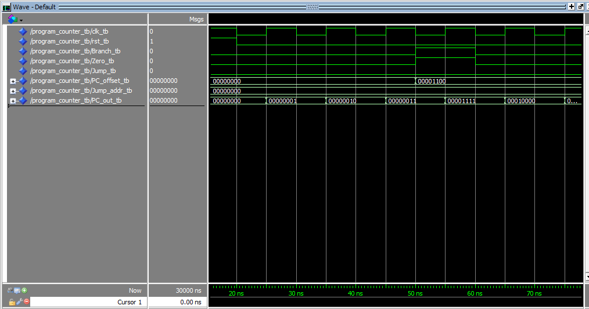

# Contador de Programa - VHDL

## 🔍 Descrição

O **Contador de Programa (PC)** é um componente essencial do processador, responsável por manter o endereço da próxima instrução a ser executada. O PC é incrementado a cada ciclo de clock, ou atualizado com um valor específico, dependendo das condições de controle (como saltos ou desvios). Esta implementação foi desenvolvida em **VHDL** utilizando a plataforma **Quartus**, sendo um dos blocos fundamentais para o controle de fluxo de execução do processador.

---

## 🖥️ Componentes e Funcionalidade

### 🔹 **Entradas**

- **clk** - Sinal de clock (controle de temporização).
- **reset** - Sinal de reset para reiniciar o PC.
- **PC_in [7:0]** - Valor de entrada para o PC em caso de atualização via salto ou desvio (8 bits).
- **load** - Sinal de controle que, quando ativo, permite carregar o valor de **PC_in** no PC.

### 🔹 **Saídas**

- **PC_out [7:0]** - Valor atual do Program Counter (8 bits), indicando o endereço da próxima instrução.

---

## ⚙️ Implementação

A implementação do **Program Counter (PC)** em **VHDL** é realizada da seguinte forma:

1. **Incremento do PC:**
   - A cada ciclo de clock, o PC é incrementado por 1, permitindo o avanço para o próximo endereço de memória.
2. **Atualização do PC via salto/desvio:**

   - Quando o sinal **load** está ativo, o valor de **PC_in** é carregado diretamente no **PC_out**, permitindo que o processador salte para um endereço específico.

3. **Reset:**
   - Quando o sinal **reset** é ativado, o PC é resetado para o valor inicial (geralmente `00000000`), reiniciando a execução do programa.

---

## 🛠️ Ferramentas Utilizadas

- **Quartus** - Desenvolvimento e simulação.
- **ModelSim** - Simulação e depuração do código VHDL.
- **Waveform** - Análise gráfica dos sinais e testes.

---

## 🔬 Testes e Waveforms

Os testes foram realizados no **Quartus** e **ModelSim**, utilizando simulação com **waveforms** para validar o funcionamento do **Program Counter**.

### 📌 Exemplo de Testes:

| Sinal | Descrição           | Ação                  | Saída (PC_out) |
| ----- | ------------------- | --------------------- | -------------- |
| reset | Reset ativo         | Reinicia o PC         | 00000000       |
| load  | Carregar PC_in      | Atualiza com 00001000 | 00001000       |
| clk   | Incremento de clock | Incrementa o PC       | 00001001       |

### 📊 **Imagens das Simulações**

Aqui você pode observar as **waveforms** geradas no Quartus:

---

## 📂 Arquivos Relacionados

- [Pasta Program_Counter](../src/Program_Counter)
