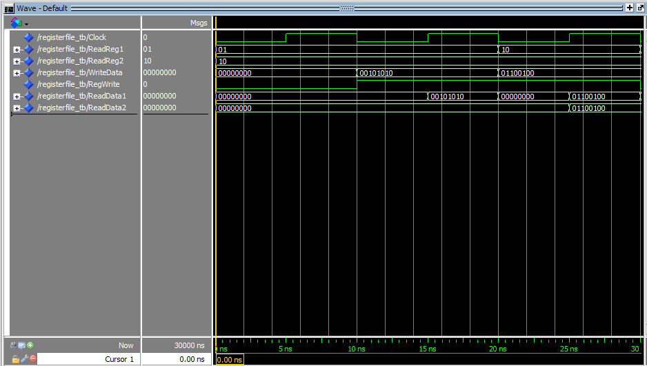

# Arquivo de Registros - VHDL

## 🔍 Descrição

O **Register File** (Arquivo de Registros) é um componente crucial no processador, responsável por armazenar e acessar os valores dos registradores utilizados nas operações do processador. Este módulo permite leitura e escrita em dois registradores diferentes simultaneamente, além de fornecer um sinal de controle para selecionar qual registrador acessar. A implementação foi realizada em **VHDL** utilizando a plataforma **Quartus**.

---

## 🖥️ Componentes e Funcionalidade

### 🔹 **Entradas**

- **clk** - Sinal de clock (controle de temporização).
- **reset** - Sinal de reset para limpar o Register File.
- **RegWrite** - Sinal de controle que, quando ativo, permite escrever no registrador selecionado.
- **ReadReg1 [2:0]** - Endereço do primeiro registrador de leitura (3 bits).
- **ReadReg2 [2:0]** - Endereço do segundo registrador de leitura (3 bits).
- **WriteReg [2:0]** - Endereço do registrador de escrita (3 bits).
- **WriteData [7:0]** - Dados a serem escritos no registrador selecionado.

### 🔹 **Saídas**

- **ReadData1 [7:0]** - Dados lidos do primeiro registrador.
- **ReadData2 [7:0]** - Dados lidos do segundo registrador.

---

## ⚙️ Implementação

O **Register File** é implementado da seguinte forma em **VHDL**:

1. **Leitura de Registradores:**

   - Quando o clock está ativo, o **Register File** permite ler os valores dos registradores de acordo com os endereços fornecidos por **ReadReg1** e **ReadReg2**.

2. **Escrita em Registrador:**

   - Se o sinal **RegWrite** estiver ativo, o valor presente em **WriteData** é armazenado no registrador indicado por **WriteReg**.

3. **Reset:**
   - Quando o sinal **reset** é ativado, todos os registradores do **Register File** são limpos, ou seja, seu conteúdo é zerado.

---

## 🛠️ Ferramentas Utilizadas

- **Quartus** - Desenvolvimento e simulação.
- **ModelSim** - Simulação e depuração do código VHDL.
- **Waveform** - Análise gráfica dos sinais e testes.

---

## 🔬 Testes e Waveforms

Os testes foram realizados no **Quartus** e **ModelSim**, utilizando simulação com **waveforms** para validar o funcionamento do **Register File**.

### 📌 Exemplo de Testes:

| Sinal        | Descrição               | Ação                                   | Saída (ReadData1, ReadData2) |
| ------------ | ----------------------- | -------------------------------------- | ---------------------------- |
| RegWrite = 1 | Escrita no Registrador  | Escreve 10101010 no Registrador 000    | 10101010, -                  |
| RegWrite = 0 | Sem escrita no Registro | Lê valores dos Registradores 000 e 001 | 10101010, 11001100           |
| reset = 1    | Reset dos Registradores | Limpa todos os Registradores           | 00000000, 00000000           |

### 📊 **Imagens das Simulações**

Aqui você pode observar as **waveforms** geradas no Quartus:

---

## 📂 Arquivos Relacionados

- [Pasta RegisterFile](../src/RegisterFile)
