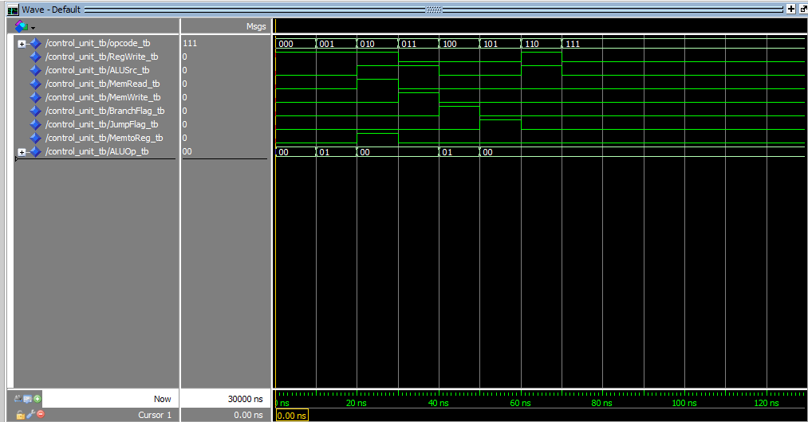

# Unidade de Controle - VHDL

## 🔍 Descrição

A **Unidade de Controle (UC)** é responsável por coordenar a execução das instruções no processador, gerando sinais de controle para a **ULA**, registradores e demais componentes do datapath.

Esta implementação foi desenvolvida em **VHDL** utilizando o **Quartus**, com testes realizados no **ModelSim** e visualização das **waveforms** para validação dos sinais de controle.

---

## 🏗️ Funcionamento

A Unidade de Controle recebe um **opcode** e, com base nele, gera sinais para definir as operações que o processador deve executar.

### 🔹 **Entradas**

- **Opcode [3:0]** → Define a operação a ser executada.
- **Clock** → Sinal de clock para sincronização.
- **Reset** → Reinicializa os estados da UC.

### 🔹 **Saídas**

- **Sinais de Controle** → Ativam ou desativam diferentes partes do processador, incluindo:
  - Controle da **ULA** (definição da operação a ser executada).
  - Controle de **registradores** (habilita escrita/leitura).
  - Controle de **memória** (sinaliza leitura/escrita).

---

## ⚙️ Implementação

A UC foi implementada como uma **Máquina de Estados Finitos (FSM)**, onde cada estado define o comportamento da CPU para cada ciclo de instrução.

1. **Busca (Fetch)**

   - Carrega a próxima instrução da memória.

2. **Decodificação (Decode)**

   - Identifica o tipo de instrução com base no **Opcode**.

3. **Execução (Execute)**

   - Gera sinais para realizar operações como soma, subtração, deslocamentos, entre outras.

4. **Escrita (Write Back)**
   - Armazena o resultado no registrador apropriado.

Cada estado controla quais sinais são ativados, garantindo o funcionamento correto do processador.

---

## 🛠️ Ferramentas Utilizadas

- **Quartus** → Desenvolvimento e simulação.
- **ModelSim** → Simulação e depuração do código VHDL.
- **Waveform** → Análise gráfica dos sinais de controle e estados da FSM.

---

## 🔬 Testes e Waveforms

Os testes foram realizados no **Quartus** e **ModelSim**, utilizando **waveforms** para validar a geração dos sinais de controle.

### 📌 Exemplo de Testes

| Opcode | Operação  | Sinal de Controle          | Estado   |
| ------ | --------- | -------------------------- | -------- |
| 0000   | Soma      | ULAOp = 0000, RegWrite = 1 | Execução |
| 0001   | Subtração | ULAOp = 0001, RegWrite = 1 | Execução |
| 0010   | Load      | MemRead = 1, RegWrite = 1  | Escrita  |
| 0011   | Store     | MemWrite = 1, RegWrite = 0 | Escrita  |

### 📊 **Imagens das Simulações**

Aqui você pode observar as **waveforms** geradas no Quartus:

---

## 📂 Arquivos Relacionados

- [Pasta Unidade de Controle](../src/Control_Unit)
